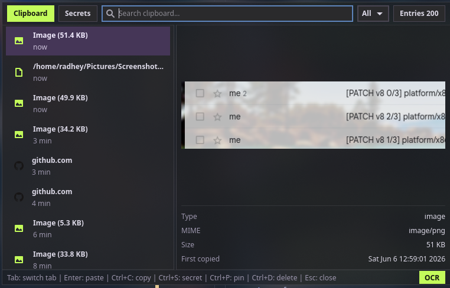

# rsclip

rsclip is a small Rust clipboard manager for Wayland desktops. It uses a low-memory daemon to
capture clipboard content and a separate resident GTK4 UI that starts on demand, stays warm,
and is activated by later `rsclip` invocations.



## Current scope

- SQLite-backed text and image history.
- `rsclipd store --mime ...` for manual or watcher-driven ingestion.
- `rsclipd watch` to spawn `wl-paste --watch` text and PNG watchers.
- Text, link, and color classification.
- Image payload storage under XDG data directories.
- Resident GTK4 history window with search, filters, preview, copy, and auto-paste.
- OCR command plumbing through `rsclipd ocr`.

## Build

```bash
cargo build
```

On Arch/CachyOS, the GTK4 layer-shell system dependency is required for the overlay UI:

```bash
sudo pacman -S gtk4-layer-shell
```

Runtime tools expected by the full flow:

```bash
wl-copy wl-paste wtype tesseract
```

## Try it

Manual storage:

```bash
printf 'hello from rsclip' | cargo run -p rsclip-daemon --bin rsclipd -- store --mime text/plain
cargo run -p rsclip-daemon --bin rsclipd -- list
```

Run the watcher:

```bash
cargo run -p rsclip-daemon --bin rsclipd -- watch
```

Open the UI:

```bash
cargo run -p rsclip-ui --bin rsclip
```

The first `rsclip` launch starts the UI process. Later invocations activate the existing
process instead of cold-starting another overlay:

```bash
rsclip              # show the resident UI
rsclip show         # show the resident UI
rsclip toggle       # hide if visible, show if hidden
rsclip quit-ui      # stop the resident UI process
rsclip list         # print history without starting GTK
```

On boot, the packaged systemd service starts only the headless `rsclipd watch` daemon.
That keeps clipboard capture running, but it does not preload the GTK UI. The first
hotkey or `rsclip show` after login may take a little longer while the resident UI
process and window runtime are created; subsequent opens reuse that warm process.

Keep `rsclipd watch` as the headless service. The UI and daemon are separate processes; the
daemon stores history in SQLite and notifies the UI over the existing Unix datagram socket.

Install the service and desktop file by adapting the files under `packaging/`.

## Configuration

rsclip reads `~/.config/rsclip/config.toml`. Start from `config.example.toml`
for the full set of options.

History settings control UI list size, payload caps, dedupe behavior, and optional
soft cleanup for old unpinned entries. Byte caps and cleanup use `0` as disabled.

```toml
[history]
max_entries = 5000
max_text_bytes = 1048576
max_image_bytes = 10485760
dedupe = true
cleanup_unpinned_after_days = 0
```

Paste behavior is configurable for the resident UI:

```toml
[paste]
auto_paste = true
paste_delay_ms = 140
method = "wtype"
```

OCR defaults are shared by the UI button and `rsclipd ocr`:

```toml
[ocr]
enabled = true
command = "tesseract"
default_language = "eng"
timeout_seconds = 20
auto_index = false
```

The resident UI also supports geometry and behavior settings:

```toml
[ui]
window_width = 920
window_height = 620
background_opacity = 0.70
preview_default = true
sidebar_width = 320
start_view = "clipboard"
default_filter = "all"
default_sort = "default"
```

The resident UI watches `config.toml` and reloads UI settings automatically.

## Theme colors

The resident UI reads optional theme colors from `~/.config/rsclip/config.toml`.
All keys under `[ui.colors]` are optional; missing keys keep the built-in
`nonchalant-dark` defaults. Supported color formats are `#rgb`, `#rrggbb`,
`#rrggbbaa`, `rgb(r, g, b)`, and `rgba(r, g, b, a)`.
Use `ui.background_opacity` for the shell backdrop transparency, or set
`ui.colors.shell_bg` directly for full RGBA control.

```toml
[ui.colors]
accent = "#ff00aa"
accent_text = "#000000"
```

Color changes are hot-reloaded by the resident UI.

## Link favicons

rsclip can optionally fetch real favicons for copied links. Network activity is disabled
by default.

```toml
[links]
favicon_cache = true
```

Favicon fetching is handled by the resident `rsclipd watch` daemon in the background.
The UI never performs network requests. Icons are cached by domain, not by full URL,
and are fetched once with no automatic refresh. Failed domains are not retried
automatically. Missing icons use generated domain initials.

Clear cached icons and failed-domain records with:

```bash
rsclipd favicons clear
```

## Release Notes

### v0.1.11

- Failed `rsclipd watch` fast when the Wayland session environment is missing or stale.
- Skipped starting the packaged user service when `WAYLAND_DISPLAY` is absent.
- Kept watcher-triggered store IDs out of the systemd journal.

### v0.1.10

- Treated `text/uri-list` clipboard payloads as file entries instead of plain text.
- Made schema startup backfill missing columns so older SQLite databases migrate cleanly.
- Reused the shared color parser for UI theme validation and removed regex-based color parsing.
- Skipped favicon network fetches for localhost, numeric, and reserved internal domains.
- Simplified favicon fallback styling and notification setup.

### v0.1.9

- Switched the resident UI history list to DB-backed virtual scrolling for large histories.
- Kept only the visible list window plus nearby rows mounted while preserving full-history totals.
- Added paged SQLite reads and count queries for clipboard and secret search results.

### v0.1.8

- Added `~/.config/rsclip/config.toml` support for history, paste, OCR, UI, color, and favicon settings.
- Hot-reloaded resident UI settings and theme colors without requiring `rsclip quit-ui`.
- Removed the fixed 200-item UI cap; clipboard and secret lists now use `history.max_entries`.
- Made paste and OCR behavior configurable for both daemon commands and the resident UI.
- Added optional link favicon caching through the background daemon.

## Release and AUR

This repository can publish a binary AUR package from GitHub release assets.

- Build the release archive locally with `./scripts/build-release-archive.sh 0.1.11`.
- The AUR package definition lives under `packaging/aur/rsclip-bin`.
- Pushing a matching Git tag such as `v0.1.11` triggers GitHub Actions to publish the
  archive and update the `rsclip-bin` AUR package.
